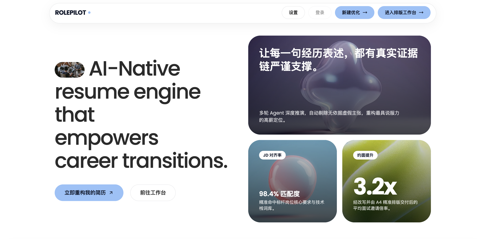

# RolePilot

> 改写简历，一款产品足以

<p align="center">
  <a href="#快速开始"><strong>开始使用</strong></a> ·
  <a href="#我们怎么解决">了解产品</a> ·
</p>


<p align="center">
  
</p>

## 为什么选择 RolePilot？
求职时，总有一件事反复消耗你的时间：改简历。
经历还是那些经历，面对不同的岗位，却得重新梳理一遍。你需要的不是把话写得更漂亮，而是弄清楚：这个岗位看重什么，我的哪些经历值得展开，又该怎么把它们讲清楚。**你是否也有这样的日常？**

JD 看了好几遍，还是拿不准自己哪里匹配、哪里欠缺，简历到底该从哪儿改起；
每投一个岗位，都要把简历和 JD 重新拖进 GPT、重新交代背景、重新写 Prompt；
AI 的建议看起来头头是道，“突出成果”“量化贡献”“贴合岗位”，但具体改哪段、怎么改、先改什么，最后还是得自己动手；
岗位在招聘网站里，建议在聊天框里，简历在 Word 里。来回复制、对照版本、调整格式，改完还得转成 PDF。折腾了半天，时间都花在了搬运和切换上。

找工作已经够累了，别再让改简历变成另一份工作。
读懂岗位要求，从已有经历里找到相关内容，再组织成清楚、准确的表达。阅读材料、提炼经历、比较表达、反复修改，这些需要结合上下文处理的工作，适合由 AI 辅助完成。但只有建议还不够，你需要的是把建议真正改进简历里。
RolePilot 采用了 AI 提议 + Agent 改写 + 代码执行 的分工：AI 帮你分析岗位匹配情况、找出问题并提出建议；Agent 根据岗位匹配度和问题优先级落实改写；代码负责完成 PDF 导出。不是把所有事情都留在聊天框里，而是让每一步都有下一步。
你可以在同一个简历编辑工作台里询问 AI、审阅改写结果，也可以通过快捷操作继续调整。

从岗位分析、修改建议，到实际改写、审阅编辑，再到导出 PDF，RolePilot 把分散的操作连成了一条完整的简历改写流程。少一点重复上传和手动搬运，多一点时间打磨真正重要的经历，准备接下来的面试。


### Who：需要对结果负责的求职者

RolePilot 面向需要反复打磨求职材料的人：

- 有一份真实经历，想针对不同 JD 调整重点；
- 不想在多轮对话中手工维护多个版本；
- 需要知道某处为什么被修改，也不接受凭空增加经历；
- 希望最终结果能直接继续编辑、打印和使用。

## 我们怎么解决

RolePilot 是一个面向求职场景的**Resume Agent**。

```text
原始材料 → Mine → JD Analysis → Preflight → Write
                                      ↓
                         Review → Router → 单个动作 → Re-review
                                      ↓
                              Final → Workbench
```

- **证据边界**：原稿和用户明确补充是来源；未知信息不会被岗位要求自动补成事实。
- **确定性控制**：LLM 负责结构化诊断和修改建议；代码负责白名单动作、证据检查、预算和停止条件。
- **有限优化**：每轮最多执行一个修改动作；没有改善或额度用尽就停止，避免无限重写。
- **双稿工作台**：原稿和 Agent 新稿保持分离，可以继续编辑、撤回、重排和手动保存。
- **浏览器交付**：HTML 工作台适合继续排版和打印，减少复制粘贴与格式返工。

## 功能

| 能力 | 作用 |
| --- | --- |
| 简历 Agent | 从原始材料到 Final，按阶段运行并保留中间产物 |
| JD 定向诊断 | 区分岗位要求、已有证据和需要补充的信息 |
| Review Loop | 以 Proposal → Router → Action → Re-review 方式逐步优化 |
| Resume Workbench | 编辑原稿/新稿、撤回、重排、保存、浏览器打印 |
| Replay / Stub | 不依赖 live Provider 复现核心离线流程 |
| 本地优先存储 | 默认使用本地文件；云端存储按配置启用 |


## 快速开始

环境要求：Node.js 22+、pnpm 10.12.1、Git。

```bash
git clone <https://github.com/lzhq1211/RolePilot/>
cd RolePilot
pnpm install --frozen-lockfile
cp .env.example .env
pnpm build
```

macOS 用户双击 `RolePilot.command`，启动本地 API 和前端并打开页面。

也可以在项目根目录用两个终端分别启动。第一个终端加载 `.env` 并启动 API（以下使用 bash/zsh）：

```bash
set -a
. ./.env
set +a
pnpm --filter rolepilot-web-service start
```

第二个终端启动前端：

```bash
pnpm dev
```

打开 `http://127.0.0.1:4173`。API 默认监听 `127.0.0.1:4174`；`pnpm dev` 只启动前端。

请在 `.env` 中配置对应 Provider；不要把真实密钥提交到仓库。本项目当前只服务本地，默认使用本地存储，不需要配置 Supabase 或应用数据库迁移。

Review 默认执行 **2 轮**。可以在项目根目录的 `.env` 中调整 `ROLEPILOT_MAX_REVIEW_ROUNDS`，修改后重启 `RolePilot.command` 或 API 服务，新建 Run 才会生效。轮数越多，Agent 调用次数，修改范围和等待时间越长。

独立工作台无需后端：构建后访问 `/workbench/`，导入 Markdown/JSON 简历即可编辑和打印。

## 架构

- `apps/rolepilot-engine`：唯一的 Agent 业务编排和 CLI 入口
- `apps/rolepilot-web`：React/Vite 产品界面与工作台入口
- `apps/rolepilot-web-service`：薄 API、队列 Worker、交付读取和手动保存
- `packages/platform-policy`：Router、证据、预算和停止策略
- `packages/platform-runtime` / `platform-state`：工作流运行与 checkpoint
- `packages/platform-adapters`：Provider registry 及 live / stub / replay 隔离
- `packages/resume-workbench`：HTML 简历编辑与打印、转PDF能力

## 项目状态与贡献

RolePilot 目前是一个持续演进中的 MVP。欢迎通过 Issue 反馈可复现的问题，或提交围绕合同、离线复现、工作台体验和文档的 Pull Request。
